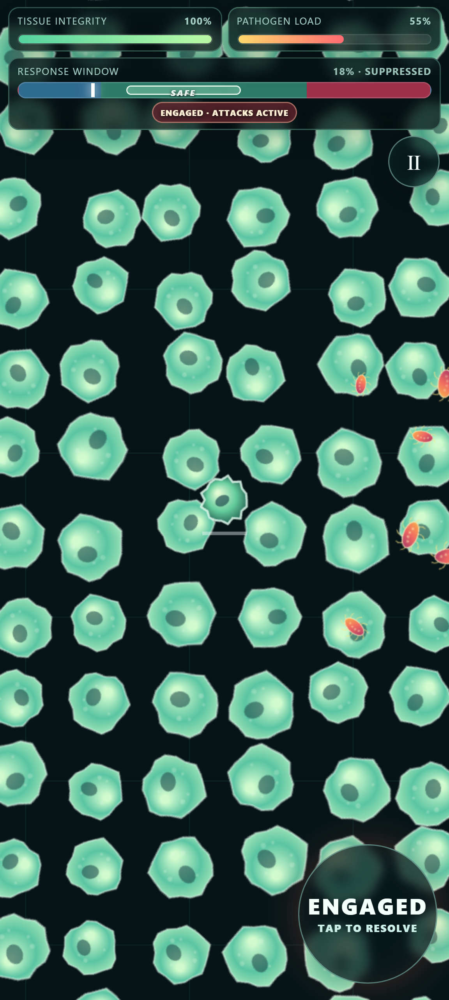

# HOMEOSTASIS

> A mobile-first immune-system survivor game: clear pathogens without letting the response destroy the tissue it is meant to protect.

[Play the current GitHub Pages release](https://falloutmule.github.io/homeostasis/)



## Status

The repository’s authoritative editable source has completed SFHS pack, exact verification, and automated Samsung Galaxy S21 Ultra Android Chrome emulation plus desktop Chromium testing. A real Samsung Galaxy S21 Ultra / stable Android Chrome acceptance is still required before the new artifact may replace the live Pages build. The Play link therefore intentionally serves the retained previous release.

- Primary target: Samsung Galaxy S21 Ultra, stable Android Chrome; portrait-first adaptive layout, landscape supported.
- Secondary target: desktop Chromium.
- Current local artifact: `homeostasis-89abc747ea11` — 593,113 bytes — SHA-256 `4bf7dbb08f26daafe278188918a54b2b407778ada7bb5700052f3d1a25cbb201` — verified 2026-08-06.
- Current Pages artifact: `homeostasis-f9724aa9fefe` — SHA-256 `97207cfa05ce4ae4db61677438b344d4a0c6ac528fcaed336ba483e268d47d6d` — [Pages URL](https://falloutmule.github.io/homeostasis/).

## How it plays

Move the response core through tissue and engage nearby pathogens. Clearing pathogens can drive inflammatory damage, so switch to Resolve to lower inflammation, repair tissue, and stabilize the response. Collect XP, choose upgrades, defeat the boss, then hold the safe response band to win.

| Platform | Controls |
| --- | --- |
| Touch | Drag on the left to move; tap the large stance button to switch Engage/Resolve. |
| Desktop | WASD / arrow keys move; Space switches stance; Escape pauses; F3 toggles diagnostics. |
| Both | The title and Pause screens offer fullscreen; Pause offers mute/unmute and restart. |

Implemented features include fixed-step seeded simulation, Engage/Resolve risk management, boss and pathogen systems, upgrades, tissue damage/repair, procedural visuals, synthesized audio, pause/fullscreen handling, and optional local settings persistence. The current limitation is release evidence: automated device emulation is passing, but direct physical Samsung acceptance is not yet recorded.

## Source, artifact, and verification

Editable source lives in `src/`, `public/`, `sfhs.project.json`, and `package.json`. `dist/index.html` is produced only by the pinned SFHS packer and must never be hand-edited. The root `index.html` is a retained previous Pages artifact, not source. `one-shot/` records source lineage and graduation decisions.

The exact test order is SFHS `inspect`, `validate`, `check`, `pack`, `verify`, then the exact-artifact Chromium proof. That proof validates Samsung S21 Ultra portrait and landscape emulation first, followed by desktop Chromium, checks controls/lifecycle/storage/renderer/network boundaries, and retains screenshots and JSON evidence. GitHub Pages will be moved to the Action workflow only after a physical Samsung PASS for the matching SHA-256; its release gate prevents a misleading deployment.

## Local development

Use the SFHS revision in `one-shot/SFHS-PIN.json`. From a checkout of this repository, stage it into that SFHS workspace at `examples/homeostasis`, then run:

```text
pnpm install --no-frozen-lockfile
pnpm sfhs inspect --json --project examples/homeostasis
pnpm sfhs validate --json --project examples/homeostasis
pnpm sfhs check --json --project examples/homeostasis
pnpm sfhs pack --json --project examples/homeostasis
pnpm sfhs verify --json --project examples/homeostasis
node examples/homeostasis/tools/run-browser-proof.mjs
```

The CI workflow is the canonical staging reference. See [Testing](docs/TESTING.md) for results and [Architecture](docs/ARCHITECTURE.md) for the build/deploy model.

## Project documents

- [Game specification](docs/GAME-SPEC.md)
- [Project status](docs/PROJECT-STATUS.md)
- [Roadmap](docs/ROADMAP.md)
- [Architecture](docs/ARCHITECTURE.md)
- [Testing](docs/TESTING.md)
- [Decisions](docs/DECISIONS.md)
- [Migration and source authority](docs/MIGRATION-PLAN.md)
- [Rights and provenance](RIGHTS.md)
- [Evidence index](evidence/README.md)

## Roadmap and rights

The only recovered approved work is physical Samsung acceptance followed by exact Action-based Pages promotion. A reuse license is possible only with an explicit owner decision; this repository does not grant one. See [ROADMAP.md](docs/ROADMAP.md), [RIGHTS.md](RIGHTS.md), and [third-party notices](THIRD_PARTY_NOTICES.md).
